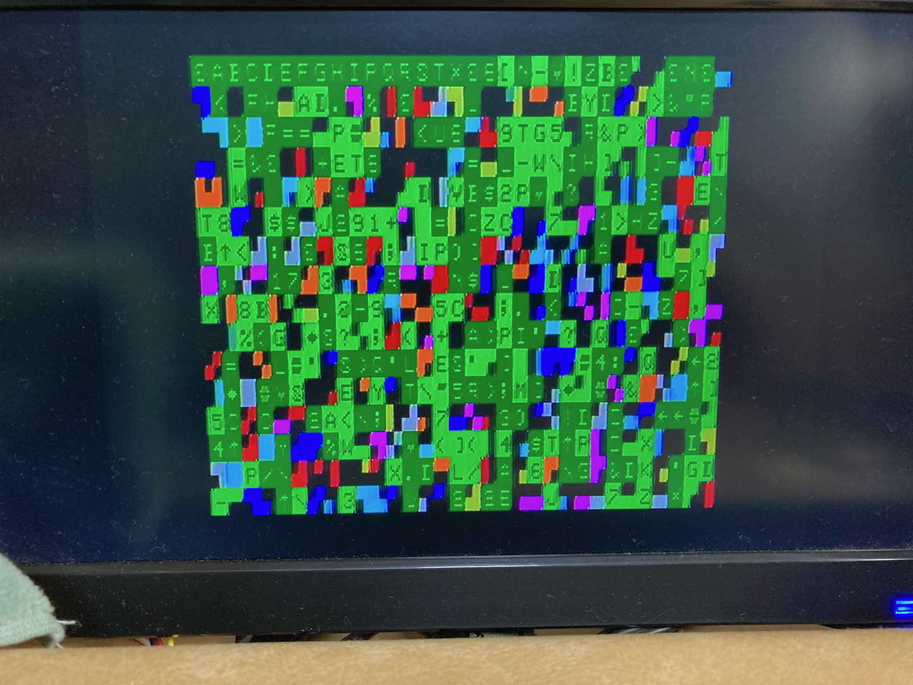
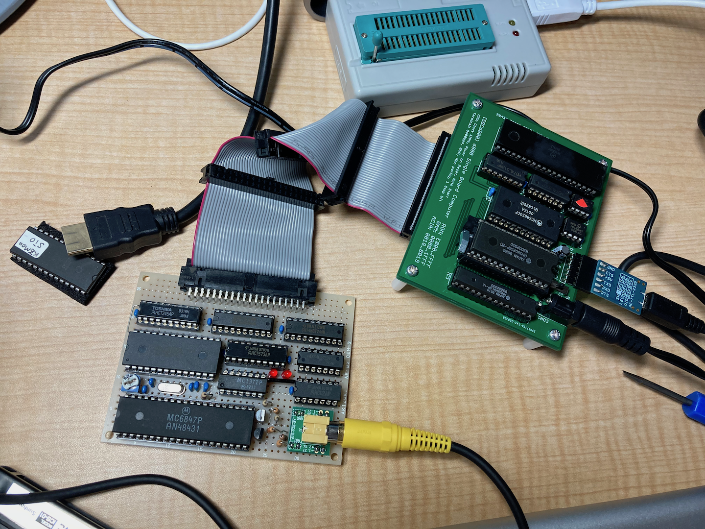

# SBC6800/6809/6303用 VDGビデオボード

## 概要
- SBC68系バスにつながるMC6847 VDG LSIを使用したビデオボードです。

## メモリーマップ
- 本基板はVRAMとして8kBのメモリー領域と、VDG設定用レジスタがメモリーマップドI/Oとしてメモリーを占有します。
- 本基板はTomi9さん作のSBC I/O( https://sbc738827564.wordpress.com/2018/08/11/sbc-io-rev02/ )と共存できることを目指しています。

|メモリーアドレス|用途|
|:---|:---|
|$8110|VDG設定用レジスタ|
|\$A000-\$BFFF または \$C000-\$DFFF|ビデオRAM|

## SBC68系バス
- Tomi9さん作のSBC I/O ( https://sbc738827564.wordpress.com/2018/08/11/sbc-io-rev02/ ) に準拠しています。SBC6303ルーズキットとは若干信号線が異なりますのでご注意ください。(ジャンパを実施すれば使えます)

## ディレクトリ構造
|ディレクトリ|用途|
|:---|:---|
|KiCAD/|KiCAD用データ|
|image/|回路図等イメージデータ|

## ライセンス
- MITライセンスで公開します。

## Special Thanks
- 本基板は先人のみなさまの情報で作成することができました。
- pmig96さん・・・MC6847テストサーキット
  - https://pmig96.wordpress.com/2020/07/24/mc6847-test-circuit-part-3/
- Tomi9さん・・・SBC I/Oボード
  - https://sbc738827564.wordpress.com/2018/08/11/sbc-io-rev02/

